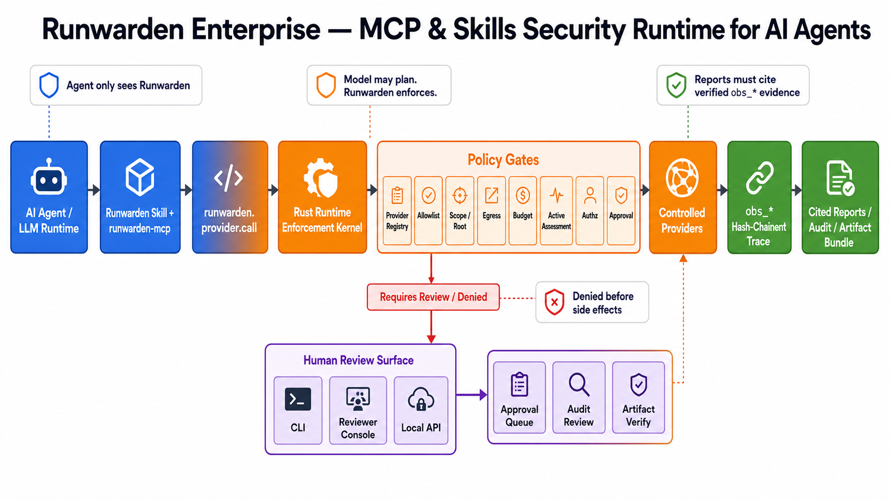
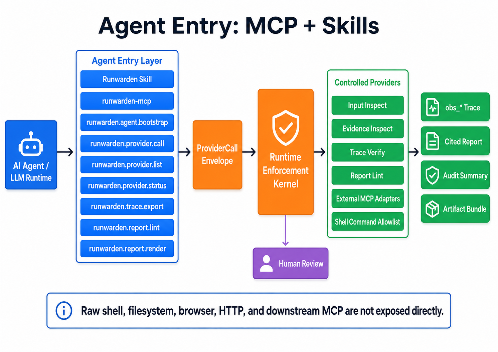
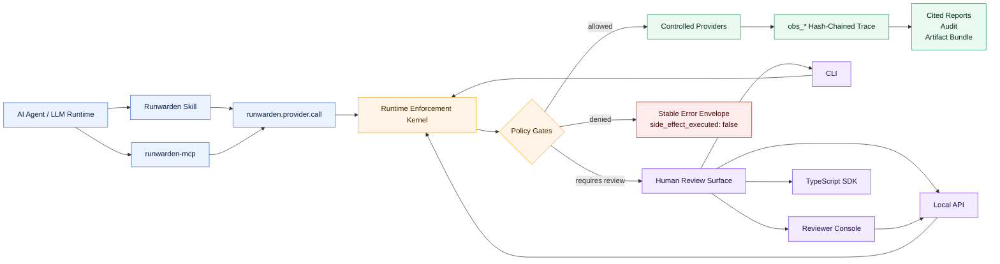
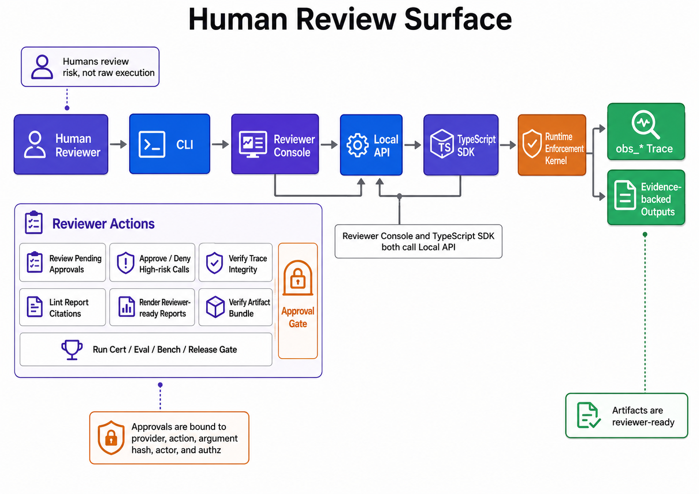
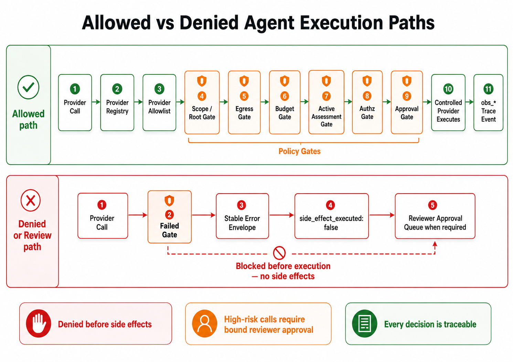
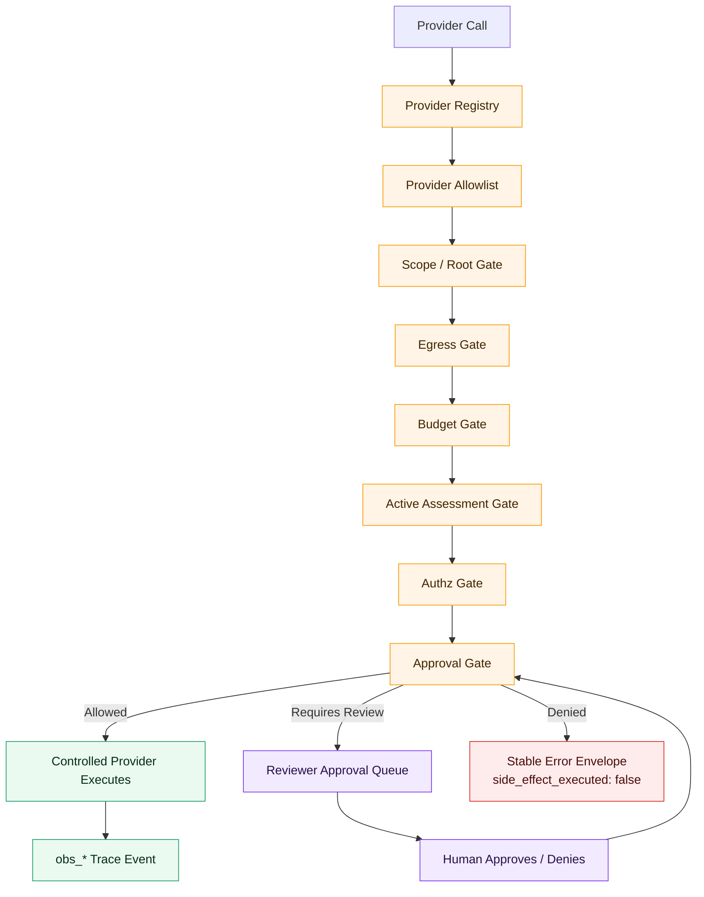
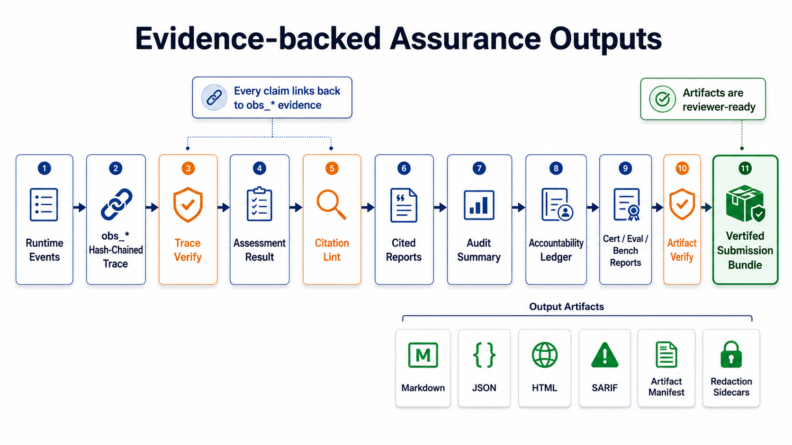

# Runwarden Enterprise

> **MCP & Skills 原生的 AI Agent 安全运行时边界**
> Agent 可以规划任务，但所有工具调用、扩展组件和执行动作都必须经过 Runwarden Kernel 强制控制。



Runwarden 的核心不是“给人手动调用的 CLI 工具”，而是一个面向智能体运行时的安全控制平面：

```text
AI Agent / LLM Runtime
    ↓
Runwarden Skill + runwarden-mcp
    ↓
runwarden.provider.call
    ↓
Rust Runtime Enforcement Kernel
    ↓
Controlled Providers
    ↓
obs_* Hash-Chained Trace
    ↓
Human Review Surface: CLI / WebUI / Local API
    ↓
Cited Reports / Audit / Artifact Bundle
```

一句话：

> **Agent 只看见 Runwarden。Runwarden 接管工具。人类审查风险、审批动作、验证证据。**

---

## 为什么需要 Runwarden

政企智能体不再只是聊天机器人。它会读取文件、访问网页、调用接口、执行命令、使用插件、加载 Skill、联动业务系统。

这带来几个风险：

| 风险 | 例子 | Runwarden 怎么做 |
|---|---|---|
| 提示注入 | 网页或附件要求 agent 忽略规则 | 输入检查 + evidence inspection + policy gate |
| 工具越权 | agent 读取不该读的文件 | scope/root gate 阻断 |
| 非法外联 | agent 或插件访问内网/未知域名 | egress gate 阻断 |
| 高危执行 | shell、浏览器、API、文件写入 | approval gate 要求人类审批 |
| 报告造假 | 报告结论没有证据引用 | report lint 要求引用 `obs_*` |
| 审计缺失 | 事后说不清谁批准了什么 | hash-chained trace + accountability summary |

Runwarden 的目标是把智能体执行面变成：

```text
可控的、可审批的、可审计的、可复现的、可提交给评审的安全运行时。
```

---

## 核心架构





---

## 真实入口：MCP + Skills

Runwarden 的 agent 入口由两部分组成：

### 1. Runwarden Skill

Skill 负责告诉 agent：

```text
不要直接调用 shell、filesystem、browser、HTTP 或下游 MCP。
所有 provider action 都必须通过 runwarden-mcp。
```

标准 agent 流程：

```text
1. 加载或创建 manifest-backed session
2. 调用 runwarden.provider.list
3. 所有动作都走 runwarden.provider.call
4. 执行 runwarden.eval.agent-native 检查 agent config
5. 导出 verified trace
6. lint report
7. 只有每个 claim 都引用 verified obs_* 后才 render report
```

### 2. runwarden-mcp

`runwarden-mcp` 是 agent 看到的安全工具边界。

| MCP Tool | 用途 |
|---|---|
| `runwarden.agent.bootstrap` | 返回 Runwarden-only agent boundary |
| `runwarden.provider.call` | 把工具请求提交到 kernel mediation path |
| `runwarden.provider.list` | 列出当前 session 可用 provider |
| `runwarden.provider.status` | 查看 provider 风险、side effects 和审批要求 |
| `runwarden.session.create_from_manifest` | 从 assessment manifest 创建 session |
| `runwarden.trace.verify` | 校验 trace hash chain |
| `runwarden.trace.export` | 导出 verified trace evidence |
| `runwarden.report.lint` | 检查报告 claim 是否引用有效 `obs_*` |
| `runwarden.report.render` | 通过 citation enforcement 渲染报告 |

未知工具不会被 Runwarden MCP 暴露。

---

## 人类审查面：CLI + WebUI + Local API

Runwarden 不是让人类手动替 agent 工作。人类控制面负责：

```text
配置 assessment
审批高风险动作
查看 pending approvals
验证 trace
复核报告引用
导出 artifact bundle
运行 eval / cert / bench / release gate
```



### CLI

CLI 是 reviewer / developer 的控制面：

```bash
target/debug/runwarden check --strict
target/debug/runwarden session create --manifest scenarios/enterprise-agent-security/manifests/assessment.toml --session enterprise_ops --json
target/debug/runwarden provider list --session enterprise_ops --json
target/debug/runwarden approval pending --json
target/debug/runwarden trace verify --trace tests/fixtures/default-trace.json --json
target/debug/runwarden report lint --report tests/fixtures/default-report.json --trace tests/fixtures/default-trace.json --json
target/debug/runwarden artifact verify --artifacts artifacts --manifest artifacts/artifact-manifest.json --json
```

### Reviewer Console

Reviewer Console 是给人看的审查工作台：

```text
Agent Boundary
Provider Registry
Approval Queue
Trace Explorer
Accountability
Reports
Artifacts
Assurance
Settings
```

启动：

```bash
target/debug/runwarden ui \
  --bind 127.0.0.1 \
  --port 8088 \
  --artifacts artifacts \
  --json
```

### Local API

Local API 给 WebUI / SDK / 本地集成使用：

```bash
target/debug/runwarden api serve \
  --bind 127.0.0.1 \
  --port 8088 \
  --once \
  --json
```

Local API 具备：

- launch token
- Host / Origin 检查
- approval queue
- approval mutation
- provider calls
- sessions
- trace export
- report lint / render / preview
- audit summary
- accountability summary
- artifact verify / token / download
- eval agent-native
- release smoke
- agent config check

---

## Kernel：所有执行动作的强制控制点



每次 provider call 都会先进入 Rust Kernel。



核心原则：

| 原则 | 说明 |
|---|---|
| Deny before side effects | 不满足策略时，在执行前拒绝 |
| Bound approval | 高风险动作审批绑定 provider、action、argument hash、actor、authz |
| One policy path | MCP、Skill、CLI、WebUI、Local API 都不能绕开 Kernel |
| Stable error envelope | 拒绝结果稳定输出，包含 `side_effect_executed: false` |
| Evidence first | 允许、拒绝、失败、审批都能形成审计证据 |

---

## Authority：Manifest-backed Session

Runwarden 使用 assessment manifest 定义一次智能体安全任务的权限边界。

示例：

```toml
version = "0.1"
name = "enterprise-agent-security"
mode = "offline"
provider_allowlist = [
  "runwarden.input.inspect",
  "runwarden.evidence.inspect",
  "runwarden.trace.export",
  "runwarden.report.lint",
  "runwarden.report.render",
]

[active_assessment]
enabled = false
```

创建 session：

```bash
target/debug/runwarden session create \
  --manifest scenarios/enterprise-agent-security/manifests/assessment.toml \
  --session enterprise_ops \
  --json
```

Session 会固化：

```text
manifest_hash
allowed_providers
roots
targets
budgets
actor_id
authz_id
governance_state
active_assessment
```

---

## Provider：Runwarden 接管工具和扩展组件

Agent 不直接调用外部工具。Agent 请求 provider，Runwarden 决定是否允许。

### First-party providers

| Provider | 用途 |
|---|---|
| `runwarden.input.inspect` | 检查用户输入、工具输入、文本风险 |
| `runwarden.evidence.inspect` | 检查 evidence root |
| `runwarden.trace.verify` | 校验 trace hash-chain |
| `runwarden.trace.export` | 导出 trace evidence |
| `runwarden.report.scaffold` | 从 trace 生成报告草稿 |
| `runwarden.report.lint` | 阻止无证据或错误引用的报告 |
| `runwarden.report.render` | 渲染 Markdown / JSON / HTML / SARIF |
| `runwarden.audit.summary` | 汇总 allow / deny / fail / review |
| `runwarden.accountability.summary` | 还原 requester / actor / authz / approval / reviewer 链路 |
| `runwarden.cert.all` | 运行认证检查 |
| `runwarden.eval.all` | 运行安全评测 |
| `runwarden.eval.agent-native` | 检查 agent config 是否只暴露 Runwarden |
| `runwarden.bench.run` | 运行 benchmark |

### External providers

| External Provider | 风险类型 |
|---|---|
| `external.mcp.browser.open_page` | network active |
| `external.mcp.filesystem.read_file` | file read |
| `external.mcp.api.request` | API / network |
| `external.mcp.scanner.run` | scanner |
| `external.shell.command` | process spawn / destructive |
| `external.plugin.security_scan` | plugin security |
| `external.skill.assessment_helper` | skill helper |
| `external.enterprise.ticket_lookup` | enterprise integration / credential use |

外部 provider 通过 manifest、schema pin、command allowlist、working root、egress policy、runtime budget 和 approval gate 管控。

---

## Evidence-backed Assurance Outputs



Runwarden 的输出不是普通日志，而是可以给 reviewer / 评委 / 审计员验证的 evidence bundle。

```mermaid
flowchart LR
    E[Runtime Events] --> T[obs_* Hash-Chained Trace]
    T --> V[Trace Verify]
    V --> R[Assessment Result]
    R --> L[Citation Lint]
    L --> C[Cited Reports]
    C --> A[Audit Summary]
    A --> G[Accountability Ledger]
    G --> B[Cert / Eval / Bench Reports]
    B --> F[Artifact Verify]
    F --> S[Verified Submission Bundle]

    V:::gate
    L:::gate
    F:::gate
    E:::in
    T:::in
    R:::out
    C:::out
    A:::out
    G:::out
    B:::out
    S:::out

    classDef in fill:#eaf2ff,stroke:#2f6fec,color:#0b1f44;
    classDef gate fill:#fff4e5,stroke:#f59e0b,color:#3f2500;
    classDef out fill:#eafaf0,stroke:#22a06b,color:#062b18;
```



支持输出：

| 输出 | 价值 |
|---|---|
| `obs_*` trace | 每个事件可追溯 |
| hash chain | 防篡改验证 |
| Markdown report | 人类可读 |
| JSON report | 机器可读 |
| HTML report | 评审展示 |
| SARIF | 安全工具兼容 |
| Audit summary | 决策统计 |
| Accountability summary | 责任链 |
| Artifact manifest | 文件哈希、redaction sidecar、obs refs |
| Redaction sidecars | 敏感信息处理记录 |

---

## 快速开始

### 1. 安装依赖

```bash
# Rust 1.95+
rustc --version

# pnpm 11.4.0+
pnpm --version
```

### 2. 构建

```bash
git clone https://github.com/jiyujie2006/runwarden.git
cd runwarden

pnpm install
cargo build --workspace
```

Windows 下把 `target/debug/runwarden` 替换成：

```text
target\debug\runwarden.exe
```

### 3. 运行开发 gate

```bash
scripts/dev_gate.sh
```

这个 gate 会运行：

```text
cargo fmt --check
cargo clippy --workspace -- -D warnings
cargo test --workspace
scripts/check_ts_contracts.sh
pnpm test
pnpm build
```

### 4. 运行 release gate

```bash
scripts/release_gate_local.sh
```

Release gate 会进一步运行：

```text
runwarden check --strict
runwarden cert all
runwarden eval all
runwarden eval scenarios
runwarden eval agent-native
runwarden bench run
runwarden release smoke
artifact submission
artifact verify
artifact leak scan
```

---

## 一条完整评审链路

```bash
# 1. 创建 session
target/debug/runwarden session create \
  --manifest scenarios/enterprise-agent-security/manifests/assessment.toml \
  --session enterprise_ops \
  --json

# 2. 查看 session 可用 providers
target/debug/runwarden provider list \
  --session enterprise_ops \
  --json

# 3. 验证 trace
target/debug/runwarden trace verify \
  --trace tests/fixtures/default-trace.json \
  --json

# 4. 检查报告引用
target/debug/runwarden report lint \
  --report tests/fixtures/default-report.json \
  --trace tests/fixtures/default-trace.json \
  --json

# 5. 渲染报告
target/debug/runwarden report render \
  --report tests/fixtures/default-report.json \
  --trace tests/fixtures/default-trace.json \
  --format html \
  --json

# 6. 生成提交包
target/debug/runwarden artifact submission \
  --full \
  --output artifacts \
  --json

# 7. 验证提交包
target/debug/runwarden artifact verify \
  --artifacts artifacts \
  --manifest artifacts/artifact-manifest.json \
  --json
```

---

## TypeScript SDK

`@runwarden/agent-sdk` 用于本地集成 Local API。

```ts
import { RunwardenClient } from "@runwarden/agent-sdk";

const client = new RunwardenClient("http://127.0.0.1:8088", {
  launchToken: process.env.RUNWARDEN_LAUNCH_TOKEN
});

const boundary = await client.agentBootstrap();
const providers = await client.providerList("enterprise_ops");

await client.reportLint({
  report_path: "tests/fixtures/default-report.json",
  trace_path: "tests/fixtures/default-trace.json"
});
```

默认情况下，launch token 只能用于 local API origin。

---

## 项目结构

```text
crates/
  runwarden-kernel/       Rust security kernel: policy, contracts, manifests, trace
  runwarden-mcp/          Agent-facing MCP boundary
  runwarden-cli/          Human review and developer control plane
  runwarden-api/          Local reviewer API
  runwarden-providers/    First-party and mediated external providers
  runwarden-assurance/    Reports, audit, accountability, eval, cert, bench, artifacts

skills/
  runwarden-security-assessment/
    SKILL.md              Agent-native Runwarden assessment flow

packages/
  agent-sdk/              TypeScript Local API client
  webui/                  Reviewer console renderer
  mcp-helpers/            MCP helper package
  config-tools/           Agent config tooling

scenarios/
  enterprise-agent-security/
    manifests/assessment.toml

tests/
  fixtures/default-trace.json
  fixtures/default-report.json

scripts/
  dev_gate.sh
  release_gate_local.sh
```

---

## 和普通方案的区别

| 普通 agent 安全方案 | Runwarden |
|---|---|
| 事后记录日志 | 事前 gate，事后 trace |
| 给 agent sandbox | 给 agent 一个 MCP + Skill 安全边界 |
| 单点 prompt injection 检测 | 输入、工具、provider、approval、report、artifact 全链路控制 |
| 人类手动检查 | Reviewer Console + CLI + Local API |
| 报告可以自由生成 | 报告必须引用 verified `obs_*` |
| 插件直接接入 | 插件、Skill、脚本、外部 MCP 都变成 kernel-managed provider |

---

## 适合的政企场景

Runwarden 适合这些高风险智能体：

- 政务办公助手
- 企业知识库问答助手
- 文档处理和审批助手
- 运维协同 agent
- 安全扫描 agent
- 业务流程办理 agent
- 跨系统 API 调用 agent
- 带 MCP / Skill / plugin 扩展生态的 agent

---

## 当前状态

Runwarden Enterprise 当前是一个 **agent-native security runtime prototype**：

- 主入口：MCP + Skills
- 核心控制：Rust Runtime Enforcement Kernel
- 人类审查：CLI + WebUI + Local API
- 输出证据：`obs_*` trace + cited reports + audit + accountability + artifact bundle

目标是支撑政企智能体的：

```text
评测 — 防护 — 审计 — 运营
```

一体化安全治理。
